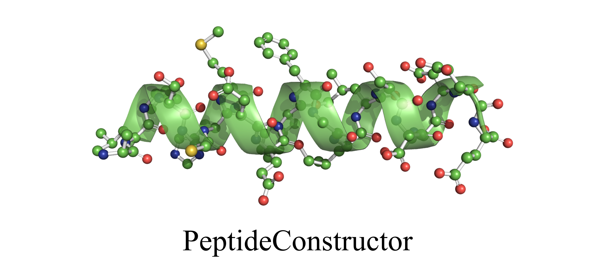

# PeptideConstructor: A simple Python library to generate model (DL-) peptides with different secondary structure.


[](https://badge.fury.io/py/PeptideConstructor)





## Still working on this:

- [x] add D amino acids support
- [x] add command-line interface support
- [ ] add support of more amino acids
- [ ] add support of adding amino acids to existing protein
- [ ] add energy minimization or conformation optimization support
- [ ] further more, add DNA/RNA support

## Installation

You can easily install PeptideConstructor with pip:

```
pip install PeptideConstructor
```

or just clone this repo and run:

```
python setup.py build
python setup.py install
```

PeptideConstructor has two required dependency: 
- `Biopython` for PDB IO.
- `Numpy` for coordinates calculation.

## Usage

After installation, `PCcli` command could be called in your terminal. `PCcli` could generage peptide PDB file from sequence in a simple way.

For instance:

```
PCcli -s AaDdKSQym -o test.pdb
```
which will generage a test.pdb file in current directory which contains a peptide with sequence of `AaDdKSQym`, in which, uppercase indicates L amino acids and lowercase indicates D amino acids. 

Also, secondary structure and capping of peptide could be applied through `PCcli`.

```
PCcli -s AaDdKSQym -o test.pdb -ss a -cap 1
```

**parameters** : 

- `-s` : peptide sequence. Uppercases indicate L amino acids while lowercases indicate D amino acids
- `-o` : output PDB file name
- `-ss` : (optional) secondary structure you want:
  -  `l` for no secondary structure assignment (default)
  -  `a` for alpha helix 
  -  `b` for beta sheet 
  -  `la` for left hand helix 
  -  `lb` for mirror inverted beta sheet
- `-cap` : (optional) cappings:
  - `0` for no cappings (default)
  - `1` for cappings (`ACE` in the N terminal and `NME` in the C terminal)
  - `2` for only adding `ACE` to the N termial 
  - `3` for only adding `NME` in the C terminal 

**examples** : 

Sure you could generage peptide in original way by writing codes.

check examples/ directory for more examples of generating peptide by code.

 see [PeptideBuilder](https://github.com/clauswilke/PeptideBuilder) for more infomation.


## Post-processing Tools Recommandation:

1. add hydrogens : reduce, PyMol, TINKER
2. structure optimization: Avogadro/EM, PyMol/sculpt, ModRefiner, TINKER/minimize

## Contributing

Pull requests are welcome on GitHub. However, to be accepted, contributions must:

1. Be styled with [`black`](https://black.readthedocs.io/en/stable/)
2. Be linted with `pylint`
3. Be type-checked with `mypy`
4. Pass the `pytest` unit tests

Thus, before contributing code make sure the following commands exit without errors when run from the root directory of the PeptideConstructor project:

- `pytest`
- `black .`
- `mypy PeptideConstructor/`
- `pylint --rcfile=setup.cfg PeptideConstructor/`

## Others

This repo is based on [Lun4m/PeptideBuilder.git](https://github.com/Lun4m/PeptideBuilder) and [clauswilke/PeptideBuilder.git](https://github.com/clauswilke/PeptideBuilder). 

**Cite the original paper**:

M. Z. Tien, D. K. Sydykova, A. G. Meyer, C. O. Wilke (2013). PeptideBuilder:
A simple Python library to generate model peptides. PeerJ 1:e80.
